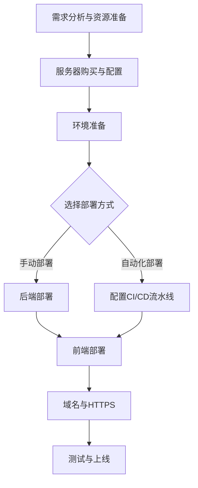

将你的前后端项目完整地发布到线上，确实涉及一系列环环相扣的步骤。别担心，我们把它梳理成一个清晰的路线图。为了让你对全局有个把握，我们先通过一张图来了解从准备到发布的完整流程：



下面，我们详细讲解每个环节的具体操作。

### 🖥️ 部署前的准备工作

在动手之前，充分的准备能让你在后续部署中事半功倍。

*   **项目生产环境适配**：这是最关键的一步。你需要确保项目在服务器上也能正常运行。
    *   **后端配置**：创建一个生产环境专用的配置文件（如 `application-prod.yml`），将数据库连接、Redis配置、日志路径等中的`localhost`改为服务器上实际的地址或服务名称，并使用强密码。
    *   **前端配置**：将前端代码中请求后端API的地址（通常是`http://localhost:8080`）修改为你的云服务器公网IP或即将设置的域名。同时，可以使用环境变量来动态设置这些配置，避免硬编码。
*   **项目打包**：在本地对前后端项目分别进行打包操作。
    *   **后端打包**：对于Spring Boot项目，使用Maven命令 `mvn clean package -DskipTests` 进行打包，生成JAR文件。
    *   **前端打包**：对于Vue/React项目，运行 `npm run build` 命令，这会在项目目录下生成一个 `dist` 文件夹，里面是优化和压缩后的静态资源。

### 📦 手动部署方案

这是一种基础但直接的方式，适合理解和控制整个部署过程。

*   **环境准备与文件上传**：
    *   通过SSH工具（如XShell）连接到你的云服务器。
    *   在服务器上安装项目运行所需的基础软件环境，例如JDK（用于运行Java后端）、Nginx（作为Web服务器和反向代理）、MySQL、Redis等。你也可以考虑使用Docker来容器化地安装和管理这些服务，从而保证环境一致性。
    *   使用FTP工具（如Xftp）或SCP命令，将打包好的后端JAR包和前端`dist`文件夹上传到服务器的指定目录。
*   **启动服务与反向代理配置**：
    *   在服务器上使用 `java -jar your-app.jar` 命令启动后端应用。但这样启动的程序在SSH连接断开后会停止。为了让后端服务在后台持续运行，可以使用 `nohup` 命令配合 `&`（如 `nohup java -jar your-app.jar &`），或者使用更专业的进程管理工具如PM2。
    *   配置Nginx。它的核心作用有两个：一是托管前端静态文件，二是将前端发来的API请求**反向代理**给后端服务。一个基本的Nginx配置示例如下：

```nginx
server {
    listen 80;
    server_name your-domain.com; # 你的域名或服务器IP

    # 1. 托管前端静态文件
    location / {
        root /path/to/your/dist/folder;
        index index.html;
        try_files $uri $uri/ /index.html; # 支持前端路由
    }

    # 2. 将API请求反向代理给后端服务
    location /api/ {
        proxy_pass http://localhost:8080; # 转发到后端服务运行的端口
        proxy_set_header Host $host;
        proxy_set_header X-Real-IP $remote_addr;
    }
}
```
配置完成后，使用 `nginx -s reload` 重新加载配置使其生效。

### 🔄 自动化部署方案

当项目需要频繁更新时，自动化部署能极大提升效率并减少人为错误。

*   **使用Docker容器化**：Docker可以将你的应用及其所有依赖打包成一个镜像，实现环境隔离和一致性。你需要为前后端分别编写`Dockerfile`，定义构建镜像的步骤。然后使用`docker-compose.yml`文件来编排和同时启动多个容器（如后端、数据库、缓存等）。
*   **使用Jenkins搭建CI/CD流水线**：Jenkins是一个流行的自动化服务器，可以实现持续集成和持续部署。
    *   **安装Jenkins**：在服务器上安装Java环境后，根据官方文档安装并启动Jenkins。
    *   **创建流水线任务**：在Jenkins中创建一个Pipeline任务，配置它监听你的代码仓库（如GitHub）。
    *   **编写流水线脚本**：在脚本中定义自动化流程：当代码更新并推送到仓库的特定分支时，Jenkins会自动拉取最新代码，执行构建（如`mvn package`, `npm run build`），生成Docker镜像，并部署到服务器上。这样就实现了“一次提交，自动上线”。

### 🌐 配置域名与HTTPS证书

让用户通过专业、安全的域名访问你的网站。

*   **购买与解析域名**：
    *   在域名注册商（如阿里云、腾讯云、西部数码等）选择一个易记的域名并购买。
    *   购买后，在域名管理后台添加一条**A记录**，将域名指向你的云服务器公网IP地址。DNS解析全球生效需要一定时间（通常几小时到48小时）。
*   **申请与部署SSL证书**：
    *   你可以从云服务商或Let‘s Encrypt等机构获取免费的SSL证书。
    *   申请证书通常需要生成一个CSR文件，然后提交给证书颁发机构进行验证。验证通过后下载证书文件。
    *   将证书文件上传到服务器，并修改Nginx配置，启用HTTPS并设置证书和私钥的路径。同时，可以配置HTTP请求自动跳转到HTTPS，增强安全性。一个简单的配置片段如下：

```nginx
server {
    listen 443 ssl;
    server_name your-domain.com;
    ssl_certificate /path/to/your_domain.crt;
    ssl_certificate_key /path/to/your_domain.key;
    # ... 其他SSL配置和前文相同的location规则
}

server {
    listen 80;
    server_name your-domain.com;
    return 301 https://$server_name$request_uri; # HTTP重定向到HTTPS
}
```

### 🚀 上线前最终检查

在正式对外发布前，请核对以下清单：
*   [ ] 后端服务是否在服务器上成功启动，且日志无报错。
*   [ ] 前端页面是否能在浏览器中通过IP地址或域名正常打开和显示。
*   [ ] 前端页面是否能成功调用后端API（如登录、数据加载）。
*   [ ] Nginx配置是否正确，反向代理是否生效。
*   [ ] 域名解析是否已生效（可通过`ping your-domain.com`检查）。
*   [ ] HTTPS证书是否部署成功，浏览器地址栏是否有锁形标志。
*   [ ] 如果使用自动化部署，流程是否能被代码提交正确触发。